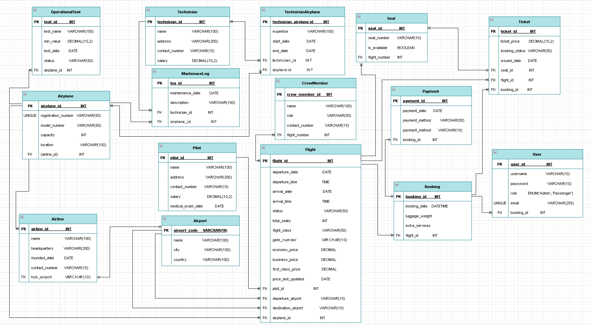
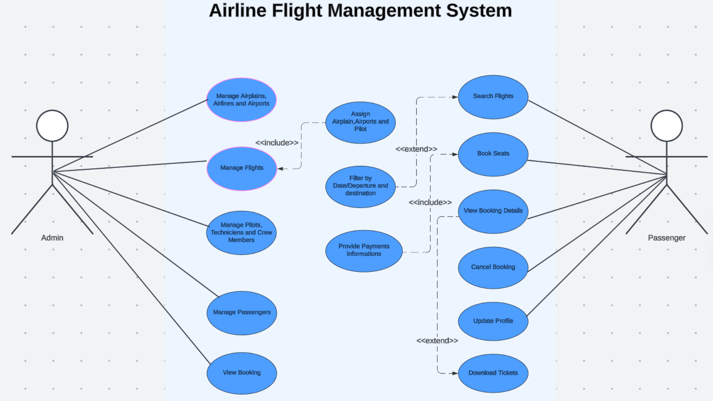
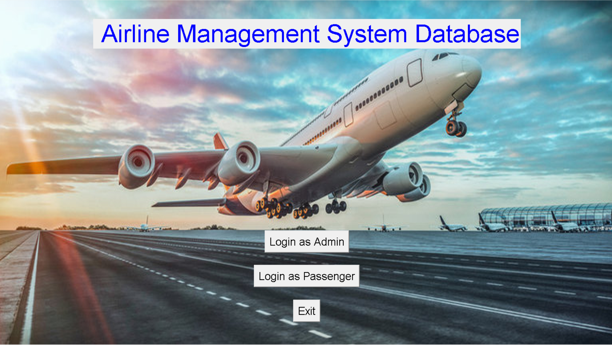
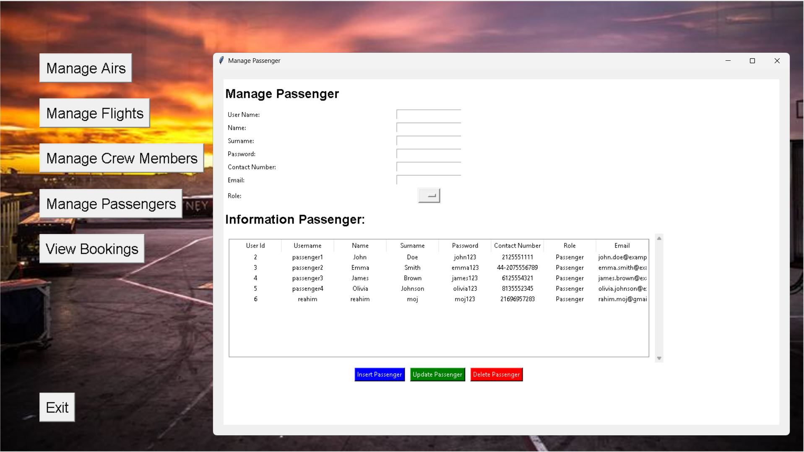
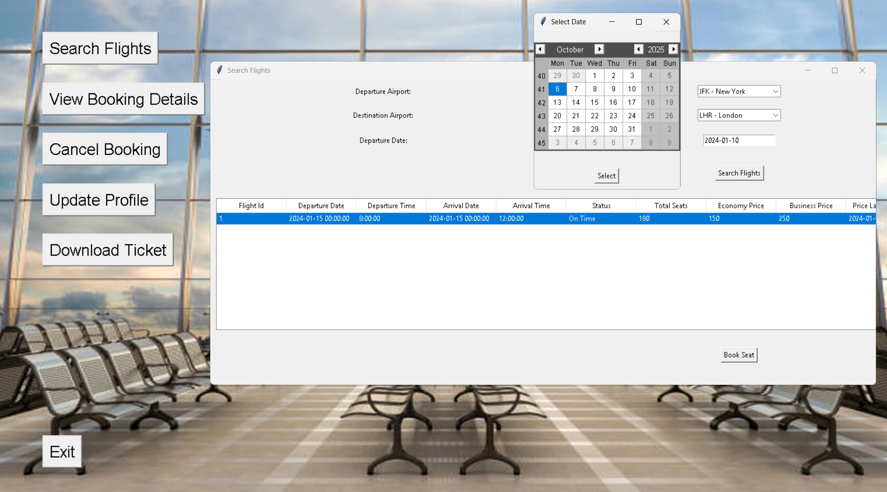

# ✈️ Airline Flight Management System

A desktop-based airline management system built with **Python**, **MySQL**, and **Tkinter** that allows admins to manage flights, airplanes, and passengers, while users can book and manage their own flights.

---

## 📚 Table of Contents
- [Overview](#-overview)
- [Features](#-features)
- [System Architecture](#-system-architecture)
- [Project Structure](#-project-structure)
- [Installation & Setup](#-installation--setup)
- [Project Diagrams](#-project-diagrams)
- [Application Screenshots](#-application-screenshots)
- [Requirements](#-requirements)
- [Contributing](#-contributing)
- [License](#-license)
- [Author](#-author)

---

## 🌍 Overview
The **Airline Flight Management System** is designed to handle operations of an airline company, including managing flights, airplanes, airports, and passengers.  
It provides two interfaces:
- **Admin Interface**: for managing operations and data.
- **Passenger Interface**: for booking and managing flight reservations.

---

## 🧩 Features

### 👨‍✈️ Admin Features
- Manage airplanes, airlines, airports, and crew
- Add, edit, and delete flights
- View passengers and bookings
- Search and filter flight data

### 🧳 Passenger Features
- Create an account and log in
- Search available flights
- Book or cancel flights
- Download tickets as PDF
- Update profile information

---

## 🧠 System Architecture
- **Frontend:** Tkinter (Python GUI)
- **Backend:** Python
- **Database:** MySQL
- **Libraries:** Pillow, bcrypt, fpdf2, tkcalendar

---

## 🗂️ Project Structure

```
Airline-Management-Database-System/
│
├── assets/
│   ├── backgrounds/
│   ├── screenshots/
│   └── Diagrams/
│
├── config.py
├── database.py
├── DataCnx.py
├── InsertData.py
├── main.py
├── auth.py
├── admin.py
├── passenger.py
├── utils.py
├── requirements.txt
├── .gitignore
└── README.md
```

---

## ⚙️ Installation & Setup

### 1️⃣ Clone the repository
```bash
git clone https://github.com/Abd-Rahim1/Airline-Management-Database-System.git
cd Airline-Management-Database-System
```

### 2️⃣ Install dependencies
```bash
pip install -r requirements.txt
```

### 3️⃣ Configure database
Edit your `config.py` with your own MySQL credentials:
```python
DB_CONFIG = {
    "user": "your_username",
    "password": "your_password",
    "host": "localhost",
    "database": "airline_db"
}
```

### 4️⃣ Create and populate the database
```bash
python DataCnx.py
python InsertData.py
```

### 5️⃣ Run the application
```bash
python main.py
```

---

## 🧭 Project Diagrams

### 🧩 Entity-Relationship Diagram


### 🎯 Use Case Diagram


---

## 🖼️ Application Screenshots

### 🔐 Login Interface


### 👨‍✈️ Admin Dashboard


### 🧳 Passenger Dashboard


---

## 📦 Requirements

```
mysql-connector-python
Pillow
bcrypt
fpdf2
tkcalendar
```

---

## 🤝 Contributing
1. Fork the repo
2. Create your feature branch (`git checkout -b feature/feature-name`)
3. Commit your changes (`git commit -m "feat: your message"`)
4. Push to your branch (`git push origin feature/feature-name`)
5. Open a Pull Request 🎉

---

## 🧾 License
This project is open-source and available under the **MIT License**.

---

## ✨ Author
👤 **Abd Rahim Mojbani**  
📧 [your.email@example.com]  
🌐 [https://github.com/Abd-Rahim1](https://github.com/Abd-Rahim1)
